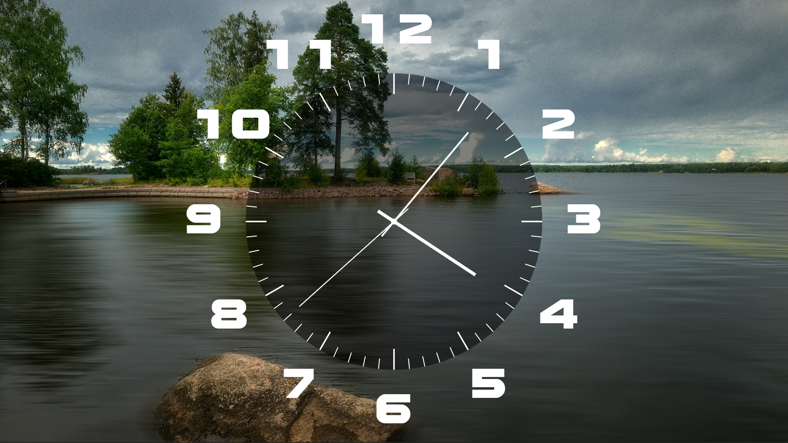

# Часы на рабочий стол для Lively Wallpaper

<p>
	
</p>

## Запуск сборки

Для запуска сборки должен быть установлен **Node Package Manager** https://nodejs.dev/en/download/, **Grunt** https://gruntjs.com/getting-started, **Bower** https://bower.io/#install-bower.

Далее запускаем установку пакетов
```
npm run inst
```
Сборку проекта
```
npm run build
```
В корне проекта будет создан zip архив (`clock-lively-wallpaper.zip`) для последующего использования.

## Установка
Чтобы установить обои нужно просто перетащить файл (`clock-lively-wallpaper.zip`) в приложение<br>или<br>Добавить обои (+) -> Выбрать файл -> Выбрать скаченный zip-файл.

## Скриншоты

<p>
	
</p>
<p>
	
</p>
<p>
	
</p>
